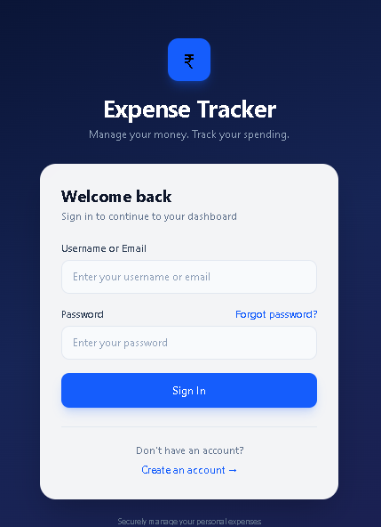
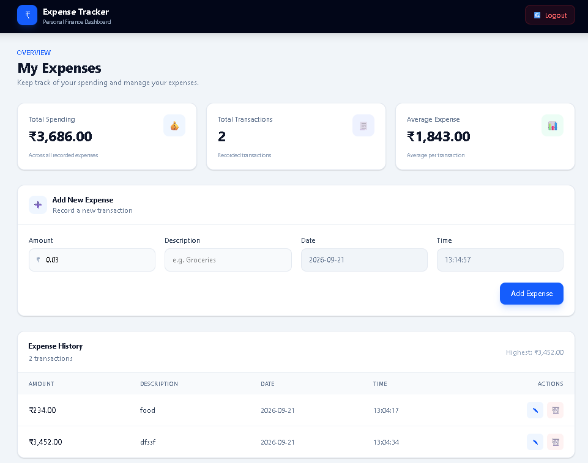

# Expense Tracker

A full-stack personal expense management application built with a Spring Boot backend and a React frontend. It helps users securely log in, track their spending, add/update/delete expenses, and monitor their monthly financial activity.

## Overview

Expense Tracker is designed for personal finance management and small-scale expense monitoring. The app supports user authentication, role-based access, and an interactive dashboard to manage expenses efficiently.

## Features

- User registration and login
- Secure authentication with Spring Security
- Password reset flow
- Add, update, and delete expenses
- View expense records for the logged-in user
- Filter expenses by month
- Admin panel to manage users
- Responsive dashboard with spending summaries
- Modern UI built with React and Tailwind CSS

## Technology Stack

### Backend
- Java 17
- Spring Boot 2.7.18
- Spring Web
- Spring Data JPA
- Spring Security
- MySQL
- Maven

### Frontend
- React 19
- Vite
- React Router DOM
- Tailwind CSS

## Project Structure

```bash
Expense-Tracker/
├── README.md
├── .gitignore
├── expense_tracker/                 # Spring Boot Backend
│   ├── pom.xml
│   ├── .gitignore
│   └── src/
│       ├── main/
│       │   ├── java/com/app/expense/
│       │   └── resources/
│       │       ├── application.properties
│       │       └── requirnment.md
├── front_expense_tracker/           # React Frontend
│   ├── package.json
│   ├── package-lock.json
│   ├── vite.config.js
│   ├── .env
│   ├── index.html
│   └── src/
│       ├── App.jsx
│       ├── main.jsx
│       ├── app.css
│       ├── component/
│       │   ├── ExpensesTracker.jsx
│       │   └── UserTracker.jsx
│       └── pages/
│           ├── Login.jsx
│           ├── Register.jsx
│           └── Password.jsx
├── screenshots/
│   ├── login.png
│   └── dashboard.png
└── .gitignore
```

## Prerequisites

Before running the project, make sure you have:

- JDK 17+
- Maven
- Node.js 18+
- MySQL database running locally

## Database Setup

Create a MySQL database:

```sql
CREATE DATABASE expense_tracker_db;
```

Then update the datasource configuration in:

```properties
expense_tracker/src/main/resources/application.properties
```

Example:

```properties
spring.datasource.url=jdbc:mysql://localhost:3306/expense_tracker_db?createDatabaseIfNotExist=true&useSSL=false&allowPublicKeyRetrieval=true
spring.datasource.username=root
spring.datasource.password=root@123
spring.jpa.hibernate.ddl-auto=update
spring.jpa.properties.hibernate.dialect=org.hibernate.dialect.MySQL8Dialect
```

## Backend Setup

Run the backend:

```bash
cd expense_tracker
mvn clean install
mvn spring-boot:run
```

The backend will run at:

```bash
http://localhost:8080/expense_tracker_hub
```

## Frontend Setup

Install dependencies and run the app:

```bash
cd front_expense_tracker
npm install
npm run dev
```

The frontend runs at:

```bash
http://localhost:5173
```

## Environment Variables

Frontend environment variables are defined in the `.env` file:

```env
VITE_BASE_URL=http://localhost:8080
VITE_CONTEXT_PATH=expense_tracker_hub
VITE_API_URI=api/expense
```

## API Endpoints

### Authentication

#### Login
```http
POST /api/expense/auth/login
```

#### Register
```http
POST /api/expense/auth/register
```

#### Reset Password
```http
POST /api/expense/auth/reset_password
```

### Expense Management

#### Add Expense
```http
POST /api/expense/user/add_expense
```

#### Update Expense
```http
PUT /api/expense/user/update_expense/{expense_id}
```

#### Delete Expense
```http
DELETE /api/expense/user/delete_expense/{expense_id}
```

#### Get All Expense Records
```http
GET /api/expense/user/get_expense_records
```

#### Get Expense Records by User
```http
GET /api/expense/user/get_expense_records_user
```

#### Get Expenses by Month
```http
GET /api/expense/user/expense_records_by_month/{month}
```

## Screenshots

### Login Screen



### Dashboard



## Notes

This project demonstrates a full-stack architecture using Spring Boot and React, with a secure backend, database-driven expense tracking, and a clean user interface for managing personal finances.

## License

This project is intended for educational and personal use unless otherwise specified by the repository owner.
